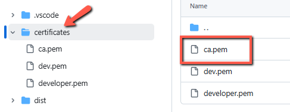
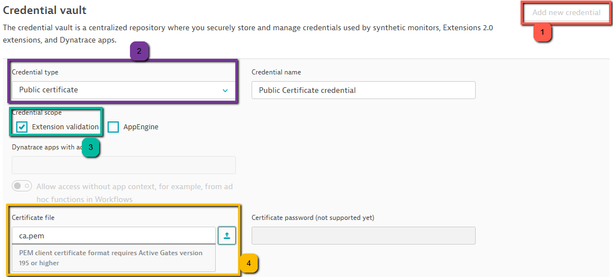

# Port Availability Extension for Dynatrace

## How to add the extension to your environment

### 1. Go to certificates folder and download the ca.pem

### 2. Open Dynatrace environment and go to Credential Vault

### 3. Go to Extension
## Running

* `dt-sdk run`

## Developing

1. Clone this repository
2. Install dependencies with `pip install .`
3. Increase the version under `extension/extension.yaml` after modifications
4. Run `dt-sdk build`

## Structure

### port_availability folder

Contains the python code for the extension

### extension folder

Contains the yaml and activation definitions for the framework v2 extension

### setup.py

Contains dependency and other python metadata

### activation.json

Used during simulation only, contains the activation definition for the extension

