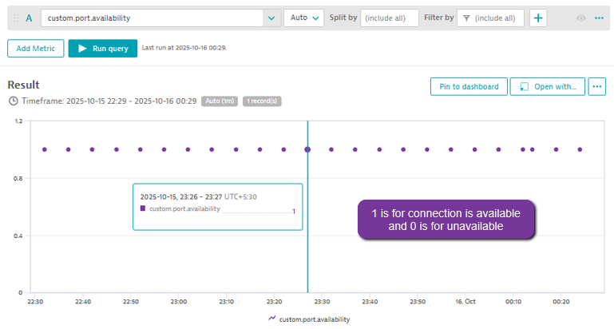

# Port Availability Extension for Dynatrace

A Dynatrace extension to monitor the availability of network endpoints (host:port) at regular intervals. This extension reports metrics to Dynatrace, allowing you to track and alert on port availability.

## Features

- Monitors the availability of TCP ports on remote hosts.
- Configurable check intervals and timeouts.
- Reports metrics to Dynatrace for dashboards and alerts.
- Graceful shutdown and thread management.
- Lightweight and scalable for up to 200 endpoints on a 4-core, 8 GB RAM server.
  

## How to add the extension to your environment

### 1. Go to certificates folder and download the ca.pem

### 2. Open Dynatrace environment and go to Credential Vault

### 3. Go to Extension

  #### Classic
  
  
  #### AppEngine
  

### 5. Configure Extension

  #### Classic
  
  
  #### AppEngine
  

### 6. Verify Extension Data

